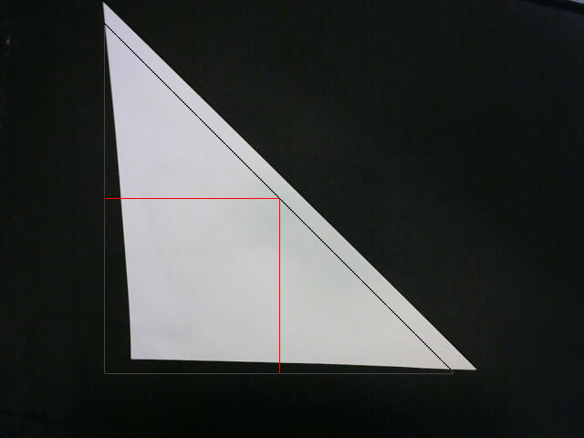

[project site](https://concavegit.github.io/cv-assisted-origami/)

# Origami (ALL AR DOCUMENTATION IN DOCUMENTS)

A program that uses webcam input to visually assist users with origami folds for a given flat construction.

## Dependencies:

  * OpenCV 3
  * Numpy 1.14.2
  * PIL 3.3+

## Quick start:

To run this software, execute _____.py.

## Usage:

Modes:

1. Unassisted: Minimum Viability

    To begin, execute the fold instructions as they are displayed on-screen. Confirm fold completion and repeat until the final instruction is reached.

2. Assisted

    To begin receiving valid webcam input, find a surface that contrasts highly with the paper being folded, and position the webcam above it. Starting from the first instruction, continue folding the paper as instructions appear on-screen.

3. Augmented: Stretch

    Follow the instructions described in (2), but fold across the line that is projected over the paper on-screen. Continue folding over new lines as they appear on the paper until lines are no longer visible.

## Contribution guidelines:

This repository can be easily forked and contributed to on Github. To suggest new changes, please submit a [pull request](https://github.com/concavegit/cv-assisted-origami/pulls).

## Questions/Concerns:

To report any bugs/issues, open a new [issue](https://github.com/concavegit/cv-assisted-origami/issues) under the repository.
